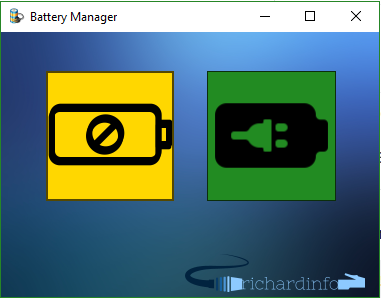

# BatteryManager

BatteryManager is a Desktop Application built with the .NET Framework and C#. 
This application use DLL files and the Windows API in order to manipulate battery settings.

## Installing

[Latest release (v1.0.zip)](https://github.com/arthuRHD/BatteryManager/archive/v1.0.zip) <br>
[Latest release (v1.0.tar.gz)](https://github.com/arthuRHD/BatteryManager/archive/v1.0.tar.gz)

### Cloning

Use the following command in your Git Bash :

```bash
git clone https://github.com/arthuRHD/BatteryManager.git || git clone git@github.com:arthuRHD/BatteryManager.git
```
## Preview



## License
[MIT](https://choosealicense.com/licenses/mit/)

## Author
[Arthur RICHARD](http://richardinfo.tk) 
